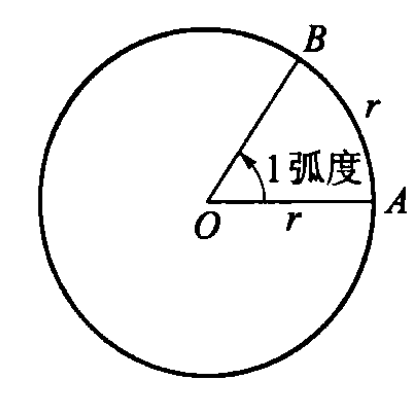
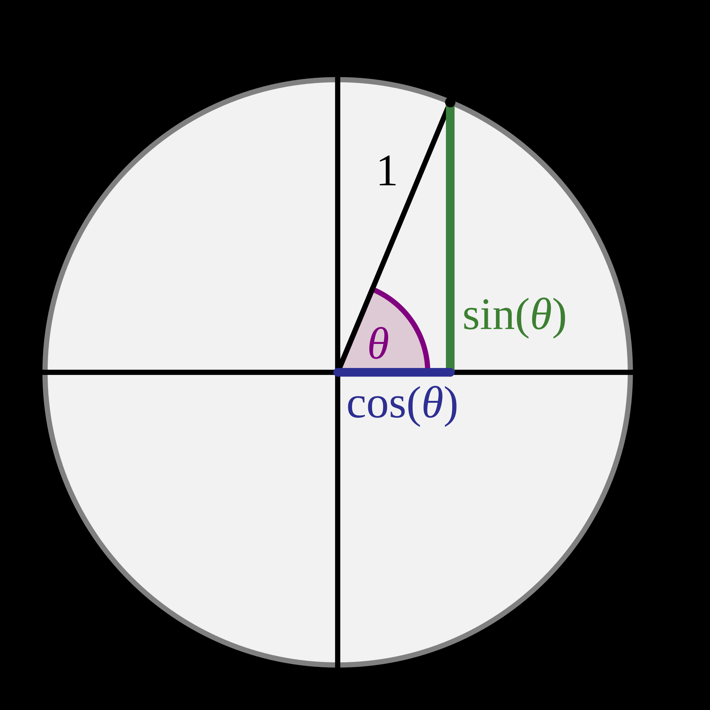

# 三角函数的概念

初中所学的角仅限于 $0\degree$ 到 $180\degree$ 之间的角，而研究的三角函数也仅限于锐角三角函数．在这一节中，我们将要把角度的范围与三角函数的定义域推广到实数域 $\R$．

## 任意角与弧度制

### 任意角

一条射线绕其端点旋转，开始时的位置与旋转后的位置之间形成的夹角叫做 **旋转角**，起始位置与最终位置分别叫做 **始边** 和 **终边**．

我们规定，按 **逆时针** 方向旋转形成的旋转角为 **正角**，按 **顺时针** 方向则为 **负角**．如果没有任何旋转，则为 **零角**．任意角包括正角、负角、零角．如图所示．

类似数轴上的数，规定 **角的加法**：在角 $\al$ 的基础上按逆时针将终边旋转角 $\be$，得到的总旋转角规定为 $\al+\be$．同时，规定按不同方向旋转相同的量所成的两个角叫做互为 **相反角**，角 $\al$ 的相反角记作 $-\al$．这样可以规定 **角的减法**：$\al+(-\be)=\al-\be$．

下面默认在平面直角坐标系 $xOy$ 中讨论角，使角的顶点与原点重合，角的始边与 $x$ 轴的非负半轴重合．

终边在第几象限，就说这个角是第几 **象限角**．如果角的终边在坐标轴上，认为这个角不属于任何一个象限，常称为 **轴线角**．

所有与角 $\al$ 终边相同的角（包括角 $\al$ 自身）构成的集合为 $S=\{\be\mid\be=\al+k\times360\degree,k\in\Z\}$．

### 弧度制

我们知道，角可以用度（$\degree$）为单位进行度量，$1\degree$ 等于周角的 $\df1{360}$．这种单位制称为 **角度制**．在角度制中，除了度，还有更小的单位分（$'$）、秒（$''$）．他们之间的换算关系是：
$$
1\degree=60',\quad1'=60''.
$$

为了数学和其他科学研究的方便，引入了 **弧度制**．

我们规定：长度等于半径长的圆弧所对的圆心角叫做 $1$ **弧度** 的角，弧度单位用 $\pu{rad}$ 表示．如图所示．

一般地，在半径为 $r$ 的圆中，设弧长为 $l$ 的弧所对的圆心角为 $\pu{\al rad}$，则
$$
|\al|=\fr lr.
$$
由此有扇形面积公式
$$
S=\fr12lr=\fr12|\al|r^2.
$$

根据 $180\degree=\pu{\pi rad}$ 可以进行角度与弧度的换算，设 $a\degree=\al$，则
$$
\bal
    a\degree&=\al\times\fr{180\degree}\pi,\\
    \al&=a\degree\times\fr\pi{180\degree}.
\eal
$$

弧度是一个无量纲单位，定义为 $\pu{1rad}=1$．因此，弧度单位 $\pu{rad}$ 常常省略不写．当在没有任何符号的情况下量化角度时，假设为弧度；当表示度数时，使用度符号 $\degree$．

欧拉用弧度制将圆弧与线段的度量相统一．弧度制具有十分优美的性质，例如：

- 欧拉公式 $\e^{\i x}=\cos x+\i\sin x$；
- 泰勒级数展开 $\sin x=x-\df{x^3}{3!}+\df{x^5}{5!}-\df{x^7}{7!}+\cdots$；
- 重要极限 $\lim\limits_{x\to0}\df{\sin x}x=1$；
- 角速度公式 $\om=\df vr$．

常用角度与弧度的对应关系如下表：

| **角度** | **$0\degree$**  | **$15\degree$**  | **$30\degree$**  | **$45\degree$**  | **$60\degree$**  | **$75\degree$**     |
| -------- | --------------- | ---------------- | ---------------- | ---------------- | ---------------- | ------------------- |
| **弧度** | **$0$**         | **$\df\pi{12}$** | **$\df\pi6$**    | **$\df\pi4$**    | **$\df\pi3$**    | **$\df{5\pi}{12}$** |
| **角度**     | **$90\degree$** | **$120\degree$** | **$135\degree$** | **$150\degree$** | **$180\degree$** | **$360\degree$**    |
| **弧度** | **$\df\pi2$**   | **$\df{2\pi}3$**  | **$\df{3\pi}4$** | **$\df{5\pi}6$** | **$\pi$**        | **$2\pi$**          |

## 任意角三角函数的概念

在平面直角坐标系 $xOy$ 中，称圆心为原点、半径为 $1$ 的圆为 **单位圆**．设角 $\al$（$\al\in\R$）的终边与单位圆的交点为 $P(x,y)$．

一般地，

- 规定 $\al$ 的 **正弦函数** 为纵坐标 $y$，即 $y=\sin\al$；
- 规定 $\al$ 的 **余弦函数** 为横坐标 $x$，即 $x=\cos\al$；
- 规定 $\al$ 的 **正切函数** 为纵坐标与横坐标的比值，即 $\df yx=\tan\al$（$x\ne0$）．

如下图所示．

当终边在 $y$ 轴上时，$x=0$，$\df yx$ 无意义，故 $\tan\al$ 的定义域为 $\{\al\mid\al\ne\df\pi2+k\pi,k\in\Z\}$．

一般地，设角 $\al$ 的终边与圆心为原点、半径为 $r$ 的圆的交点为 $P(x,y)$，则
$$
\sin\al=\fr yr=\fr y{\sqrt{x^2+y^2}},\quad\cos\al=\fr xr=\fr x{\sqrt{x^2+y^2}},\quad\tan\al=\fr yx.
$$

由于 $r=\sqrt{x^2+y^2}>0$，可以确定各个象限角与轴线角的三角函数的正负情况，如下图和下表：

| 象限角 / 轴线角 $\al$ |          $\al$ 的范围          | $\sin\al=\df yr$ （$\al\in\R$） | $\cos\al=\df xr$ （$\al\in\R$） | $\tan\al=\df yx$ （$\al\in\{\al\mid\al\ne\df\pi2+k\pi,k\in\Z\}$） |
| :----------------------: | :-------------------------------: | :-------------------------------------: | :-------------------------------------: | :----------------------------------------------------------: |
|        第一象限角        |    $(0,\df\pi2)$    |                   $+$                   |                   $+$                   |                             $+$                              |
|        第二象限角        |   $(\df\pi2,\pi)$   |                   $+$                   |                   $-$                   |                             $-$                              |
|        第三象限角        | $(\pi,\df{3\pi}2)$  |                   $-$                   |                   $-$                   |                             $+$                              |
|        第四象限角        | $(\df{3\pi}2,2\pi)$ |                   $-$                   |                   $+$                   |                             $-$                              |
|  终边在 $x$ 轴非负半轴   |            $\al=0$             |                   $0$                   |                   $1$                   |                             $0$                              |
|  终边在 $y$ 轴非负半轴   |        $\al=\df\pi2$        |                   $1$                   |                   $0$                   |                            无定义                            |
|  终边在 $x$ 轴非正半轴   |           $\al=\pi$            |                   $0$                   |                  $-1$                   |                             $0$                              |
|  终边在 $y$ 轴非正半轴   |      $\al=\df{3\pi}2$       |                  $-1$                   |                   $0$                   |                            无定义                            |

正弦函数 $y=\sin x$、余弦函数 $y=\cos x$、正切函数 $y=\tan x$ 为高中涉及到的三角函数．

*此外还有三个三角函数，高中不要求掌握：

- 余割函数 $y=\csc x=\df1{\sin x}$；
- 正割函数 $y=\sec x=\df1{\cos x}$；
- 余切函数 $y=\cot x=\df1{\tan x}$．