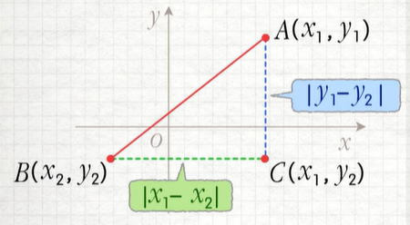

# 从点出发

在开始最简单的曲线——直线之前，我们先从平面中更简单的一个元素：点出发，了解两个点和点之间的公式．**下面的公式在考试中都可以直接使用．**

## 两点间距离公式

对于两个点 $(x_1, y_1)$ 和 $(x_2, y_2)$，它们之间的距离是 $\sqrt{(x_1 - x_2)^2 + (y_1 - y_2)^2}$．

从几何角度证明：按下图的方式构造直角三角形．

也即我们要求一个直角边分别为 $|x_1 - x_2|$ 和 $|y_1 - y_2|$ 的直角三角形的斜边长．勾股定理即可，注意绝对值在外层套上平方后可以去掉．

这里再提供一种思路，用平面向量的知识证明．

考虑设 $A = (x_1, y_1)$，$B = (x_2, y_2)$，再设 $\vec a = \overrightarrow{BA} = (x_1 - x_2, y_1 - y_2)$，我们的目标是求解 $\left|\vec a\right|$．

平面向量处理模长的常用套路是先平方再开根，也即 $\left|\vec a\right| = \sqrt{\vec a \cdot \vec a} = \sqrt{(x_1 - x_2)^2 + (y_1 - y_2)^2}$．证毕．

## 中点坐标公式

对于两个点 $(x_1, y_1)$ 和 $(x_2, y_2)$，两点连线的中点为 $\left(\dfrac{x_1 + x_2}2, \dfrac{y_1 + y_2}2\right)$．

几何角度的证明是通过画直角三角形构造中位线，相信难不倒读者，这里省略．

向量中我们也已经证明这条结论，参见坐标的定比分点公式．

## 点绕点旋转公式

求点 $A(x, y)$ 沿着坐标原点 $O$ 逆时针旋转 $\theta$ 后旋转到的点 $A'$ 的坐标．

设以 $x$ 轴正半轴为始边，$OA$ 为终边的角为 $\alpha$，$|OA| = r$，根据三角函数的定义，有 $A(r\cos \alpha, r \sin \alpha)$．因此我们有 $x = r\cos \alpha$，$y = r\sin \alpha$．

因为 $OA'$ 是 $OA$ 逆时针旋转 $\theta$ 得到的，因此以 $x$ 轴正半轴为始边，$OA'$ 为终边的角为 $\alpha + \theta$，所以有

$$
\overrightarrow{OA'} = (r\cos(\alpha + \theta), r\sin(\alpha + \theta)) = (r\cos\alpha\cos\theta - r\sin\alpha\sin\theta, r\cos\alpha\sin\theta + r\sin\alpha\cos\theta) = (x \cos\theta - y \sin \theta, x \sin\theta + y\cos\theta)
$$

因此，$A'$ 的坐标为 $(x \cos\theta - y \sin \theta, x \sin\theta + y\cos\theta)$．

更一般的情形：$A(x, y)$ 沿着 $B(x_0, y_0)$ 逆时针旋转 $\theta$ 到 $A'$，求坐标．

$\overrightarrow{BA} = (x - x_0, y - y_0)$，根据上面的结论，逆时针旋转 $\theta$ 后的向量 $\overrightarrow{BA'}$ 为：

$$
((x - x_0)\cos \theta - (y - y_0)\sin \theta, (x - x_0)\sin \theta + (y - y_0)\cos\theta)
$$

因此

$$
\begin{aligned}
\overrightarrow{OA'} &= \overrightarrow{OB} + \overrightarrow{BA'}\\
&= (x_0 + (x - x_0)\cos \theta - (y - y_0)\sin \theta, y_0 + (x - x_0)\sin \theta + (y - y_0)\cos\theta)
\end{aligned}
$$

即 $A'(x_0 + (x - x_0)\cos \theta - (y - y_0)\sin \theta, y_0 + (x - x_0)\sin \theta + (y - y_0)\cos\theta)$．
