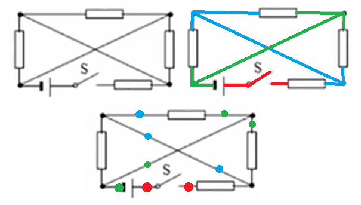

# 电路

## 基尔霍夫定律

### 基尔霍夫电流定律

> **电路稳定后，任何一个地方在相同时间内流走的电荷总量与另外又来补充的电荷总量始终相等**．即，流入的电流等于流出的电流．

电路的这种非常强的性质称作 **基尔霍夫电流定律**．当电路某个节点电荷总量入不敷出或者入大于出时，根据电荷守恒，整个电路系统不可能稳定，导线内部的电场线总会调整，使得入等于出．

这条定律也被简称为 KCL（Kirchhoff's Current Law）．

### 基尔霍夫电压定律

**电路稳定后，任意时刻，从一个节点出发，沿电路任一回路回到该节点，各段电压代数和为 $\boldsymbol 0$**．

这一定律称作 **基尔霍夫电压定律**．我们知道沿一个回路运动电势差为 $0$ 是静电场为保守场的必然结果，所以该定律实际是在说 **恒定电流形成的电场和静电场具有相似的性质——它们同为保守场**．

这条定律也被简称为 KVL（Kirchhoff's Voltage Law）.

**基尔霍夫定律** 是基尔霍夫电流定律和基尔霍夫电压定律的总和．

基尔霍夫定律与欧姆定律配合可以解决所有电学分析问题（无论多复杂的电路图）．然而，这背后的计算量往往是较为巨大的，在考场上使用基尔霍夫定律的成本通常较高．

因此，我们会基于基尔霍夫定律给出 **串并联电流电压定律**，该定律是比基尔霍夫定律适用范围更小，更弱化的版本，但形式简单，用来做电路分析计算量较小．

然而，**基尔霍夫定律仍然是更本质的电学定律**．它给出了 **电路稳定的充要条件**，使我们可以避免研究电路电场建立，电路稳定这一十分复杂的过程．**基本上一切关于电路上的电学关系，追其根本都来自于基尔霍夫的定律，因为基尔霍夫定律是基于电路稳定本身的性质的**．

## 串并联基本性质

### 理想导线的基本性质

理想导线的定义是 **电阻为 $\boldsymbol 0$ 的导线**．电路图中的导线默认为理想导线．

因为理想导线零电阻，内部的电荷移动不需要静电力维持即可保持匀速的运动，从而保证恒定的电流（至于电子是怎么从原先的静止加速到一定速度，则是电路稳定期做的事情，与我们现在的讨论无关）．因此，**同一段导线为一个等势体，内部电势处处相等，内部没有电场力**．这里的「段」不一定是线段，可以是一整个没有经过用电器的连通部分．如：

左上图为原电路图，而右上图为对电路图中「一段导线」染成一个颜色后的结果．可以看出，该电路图总共有 $3$ 段导线．每段导线内的电势相同，因此下图中蓝点电势相等，绿点电势相等，红点电势相等．

顺带一提，电路图中某个节点连接了 $>2$ 条电线的情形应该打上实心点（如上图中的四个角），否则默认这里是导线交叉而不相连（如中间 X 形状的两根导线因为中间没打点，默认不连接）．

### 串联基本性质

串联的定义是：**若干用电器仅用一根导线，无其它额外分支地串状连接**．示例：

根据基尔霍夫电流定律，相同时间内通过 $0$，$1$，$2$，$3$ 各点的电荷总量大小必然相等．因此，**串联电路中电流强度处处相等**．同时，**电路每个节点的电流方向一定是顺着导线的相同方向**，即如果上图点 $1$ 电流方向向右，则点 $2$ 电流方向不能向左．原因是这种方向相反的情形下一定会出现一个节点使得其流入电流强度和流出电流强度无法平衡，违背了基尔霍夫电流定律．

记 $\varphi_0$，$\varphi_1$，$\varphi_2$，$\varphi_3$ 为 $0$，$1$，$2$，$3$ 各点的电势．如果我们钦定 $\varphi_0 > \varphi_3$，根据先前证明的电路每个节点的电流方向一定是顺着导线的相同方向，可得电路中电流要么均向左要么均向右．再根据电势的大小关系，可得电路中的电流一定均向右．因此可推得 $\varphi_0 > \varphi_1 > \varphi_2 > \varphi_3$．

也即，**串联电路两端电势大小关系已知，则可得电路中每个节点的方向和每个用电器两端的电势大小关系**．

同时，再设 $U_{01}$，$U_{12}$，$U_{23}$，$U_{03}$ 分别表示 $0$ 与 $1$、$1$ 与 $2$、$2$ 与 $3$、$0$ 与 $3$ 之间的电势差（电压），则：

$$
\begin{aligned}
U_{01} = \varphi_0 - \varphi_1 \\
U_{12} = \varphi_1 - \varphi_2 \\
U_{23} = \varphi_2 - \varphi_3 \\
U_{03} = \varphi_0 - \varphi_3
\end{aligned}
$$

于是

$$
U_{03} = U_{01} + U_{12} + U_{23}
$$

因此，**串联电路两端的总电压等于各部分电路两端电压之和**．

上面的结论配合欧姆定律可以得到：

- **串联电路中，用电器两端电压之比等于用电器电阻之比**．$U_1 : U_2 : \ldots : U_n = R_1 : R_2 : \ldots : R_n$．
- **串联电路的总等效电阻为各电阻之和**． $R = R_1 + R_2 + \ldots + R_n$．

这两条结论初中已经给出了推导，且难度不高，在此省略证明．

### 并联基本性质

并联的定义是：**若干用电器的两端分别为同一段导线**．这里对「同一段导线」的定义同[理想导线的基本性质](#理想导线的基本性质)中的定义．下图中三个用电器就是并联的：

同一段导线电势处处相等，因此每个用电器两端的电势差相等，也就是两段导线的电势之差．因此，**并联电路的总电压与各支路电压相同**．

同时，根据基尔霍夫电流定律，节点处流入的电流必定等于节点处流出的电流．因此，**并联电路的总电流等于各支路电流之和**．

上面的结论配合欧姆定律可以得到：

- **并联电路中，通过用电器电流之比等于电阻的反比**．$I_1 : I_2 : \ldots : I_n = \dfrac{1}{R_1} : \dfrac{1}{R_2} : \ldots : \dfrac{1}{R_n}$．
	- 需要注意的是，$\boldsymbol{\dfrac{1}{R_1} : \dfrac{1}{R_2} : \ldots : \dfrac{1}{R_n} \ne R_n : R_{n - 1} : \ldots : R_1}$．两边只在 $n = 2$ 时相等，$n > 2$ 时不一定相等，如 $1 : 2 : 3 = 6 : 3 : 2$ 而不是 $3 : 2 : 1$．
- **并联电路的总等效电阻的倒数为各电阻倒数之和**． $\dfrac 1 R = \dfrac{1}{R_1} + \dfrac{1}{R_2} + \ldots + \dfrac{1}{R_n}$．
	- $n = 2$ 时，等效电阻的结论等价于 $R = \dfrac{R_1R_2}{R_1 + R_2}$．可以记忆为「鸡（积）在河（和）上飞」．
	- $n = 3$ 时结论等价于 $R = \dfrac{R_1R_2R_3}{R_1R_2 + R_1R_3 + R_2R_3}$．
	- 对于所有 $n$，等效电阻的公式：**分子为所有电阻之积**；而 **分母为缺某项电阻的剩余所有电阻之积的轮换和**．

### 混联电路处理方式

混联电路是串联和并联结合的电路．串联电路的等效电阻可以作为另一个并联电路的一部分；并联电路的等效电阻也可以作为串联电路的一部分．

处理方式就是将最小单元的串联电路和并联电路等效为一个电阻，再将这个电阻放在另一个串并联系统中定量分析．

### 电路的其它连接方式

电路并不是只有串联，并联和混联．考虑下面这个电路图：

这个电路图中，**任意两个电阻之间都不是串联或者并联关系**．比如：

- $R_1$ 和 $R_3$ 不是串联，因为中间并不是严格的串状连接，有其余的电路分支．
- $R_1$ 和 $R_2$ 不是并联，因为两电阻虽然左端是一根导线，但右端不是．

因此，**这个电路图无法套用串并联的规则来分析，只能用欧姆定律和基尔霍夫定律来分析**．高中阶段如果出现这样无法套用串并联规则分析的题目，一定会将信息设计成利用基尔霍夫定律解决时足够简单，可以直接顺推，而不用像通常用基尔霍夫定律解决电路题那样必须列很多方程才能求解，否则就是超纲了．

比如，该电路图中流经 $R_5$ 的电流走向不能确定，知道五个电阻的电阻值后方可确定，但需要用到基尔霍夫定律并解方程，高中阶段不会出．

不过无论如何，读者是不是有一种「感觉」——上面 $R_1$，$R_2$，$R_3$，$R_4$ 上的电流都是从左到右走的？这种感觉是正确的，不过需要一个结论，笔者不加证明地给出：

对于单一电源的电路，**正极连接的这一段导线** 中，这段导线树状地连接了电源的正极和若干个用电器．那么，这段导线中，**正电荷唯一的入口只在导线和电源正极的连接处，导线和其它用电器的连接出均为正电荷的出口**．同理，**负极连接的导线中正电荷唯一的出口在负极，其余连接均为入口**．于是，**正极连接的导线电势取到全局最大值；负极连接的导线电势取到全局最小值**．

将这个电路图进行分段染色，则我们一定有 $\varphi_1$ 为四个电势中的最大；$\varphi_4$ 为四个电势中的最小．进一步地，我们可以得到 $R_1$，$R_2$，$R_3$，$R_4$ 处的电流走向均是从左到右．而我们无法确定 $\varphi_2$ 和 $\varphi_3$ 的大小关系，因而无法确定 $R_5$ 处电流的走向．

### 用电器被短路

下面是一个用电器被短路的例子：

上面的电路图中总共有三段导线．设红线电势 $\varphi_1$，绿线电势 $\varphi_2$，黄线电势 $\varphi_3$．

观察到这里 $R_2$ 与 $R_3$ 两端是同一段导线，电势相等，而 $R_2$ 和 $R_3$ 是 **串联** 在一起的，因此如果 $R_2$ 与 $R_3$ 有电流通过，方向一定相同，无论从左向右还是从右向左，根据[串联基本性质](#串联基本性质)，都有 $\varphi_2 < \varphi_3 < \varphi_2$，而这显然是矛盾的．因此，$R_2$ 与 $R_3$ 一定没有电流流过．

注意到这里没有电流不意味着 $\varphi_3 = 0$ 而是 $\varphi_3 = \varphi_2$，因为这里没有电流意味着被导线并联的整个部分为等势体．

当然，这里 $R_2$ 和 $R_3$ 并联在一起也是被短路的，此时两个用电器都满足两端电势相等，因此都不可能有电流流过．更一般地，**如果一段导线两头包住了一部分电路，使得这部分电路可以整体等效为一个用电器**，或者说，**这部分电路中电荷除了并联它的导线以外没有其它出入口**，那么 **这部分电路会全部被导线短路**，成为一个 **电势处处与并联它的导线相等的等势体**，**电流处处为零**．如果你愿意，上面中间的黄线也可以画成绿线，因为它们的电势相同．

注意到上面给出了比单纯包住更强的条件．考虑下面这种情形：

$R_2$ 与 $R_3$ 两端被同一导线接上，但并没有被短路，因为这里绿色导线两头接上的部分中间还有来自电源正接线柱的电流涌入．

只有当一段导线包住的电路可以等效为用电器（即电荷没有其它出入口）时，因为电荷只能从导线的一头进，另一头出，而入口和出口是同一段导线，才能导致内部不存在电势，这才是部分短路的原理．而上面的情形中两边的绿导线都是出口，所以短路的推理不再成立．
