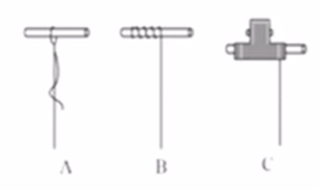

## 【实验】单摆测重力加速度

### 原理

原式：

$$
T = 2 \pi \sqrt{\dfrac L {\mathrm g}}
$$

变形：

$$
\mathrm g = \dfrac{4\pi^2}{T^2} \cdot L
$$

$$
T^2 = \dfrac{4\pi^2}{\mathrm g} \cdot L
$$

### 装置设计

#### 器材选取

绳子的两个要求：

- **弹性差，形变不明显**：否则 $L$ 不准．
- **质量小**．

选用轻质丝线是比较合适的．

小球的两个要求：

- **密度大**：减轻绳子自重带来的影响．
- **质量均匀**：使得小球的重心在几何中心位置，便于测量 $L$．

#### 绕线方式

下面三种绕线方式：

最正确的方式是 C．

A 存在的问题：

- 绳子相当于在绕着绳子系成的环在旋转，不方便确定旋转的端点，对长度测量造成困难．
- 绳子与棍间的阻力对实验存在影响．

B 存在的问题：绳子旋转的端点相当于一直在变（TODO: 加一张图片说明）．

### 物理量测量

#### $\boldsymbol T$ 的测量

测量工具：**秒表**．

实验细节一：应测多个完整周期的总时间，除以周期数得到单个周期的周期，减小实验误差．$T = \dfrac t n$．

实验细节二：现在可以设置一个锚点 $P$，使得小球摆动到 $P$ 后开始计时，摆动若干周期重新摆动到 $P$ 时停止计时．那么 $P$ 设置在中间合适还是在两边合适？**答案是中间**．原因：

- 小球经过中间的速度较快．
- 小球经过两边的速度较慢，而且实验员很难对某个时刻的小球做出是否真正到达了最高点的判断．

综上，实验员对小球到达中间的时间判断比到达两边的时间判断相比更为准确，测量误差更小．

#### $\boldsymbol L$ 的测量

测量工具：**刻度尺**．

测量重力加速度是一个比较精确的实验，$L$ 应当测的是绳头与球的质心之间的距离，不要忘记记入球的半径．

### 数据处理

测量重力加速度是一个比较精确的实验，因此我们通常选用不同的摆长 $L$ 进行多次实验．因为

$$
T^2 = \dfrac{4\pi^2}{\mathrm g} \cdot L
$$

因此 $T^2$ 与 $L$ 理论上应成正比．考虑绘制出 $T^2\text{-}L$ 图像，理论上应为一条过原点的倾斜直线．设其斜率为 $k$（量纲为 $\pu{T2L-1}$），则 $\mathrm g = \dfrac{4\pi^2} k$．

这个做法不仅降低了误差，而且允许全局的 $L$ 全部测少 / 测多相同的量，因为这对图线的影响仅仅是做了一个向左 / 向右的平移，并不影响图线的斜率（但可能不再过原点）．因此，选用这种方法，还可以每次都不测入球的半径．

而最朴素的方法，即用

$$
\mathrm g = \dfrac{4\pi^2}{T^2} \cdot L
$$

即使多次测量取平均值，对 $L$ 的测量仍然有比上述方法苛刻的要求．因此我们通常采用上面的方法．

### 误差分析

- **实验中误将 $\boldsymbol{n - 1}$ 次全振动数为 $\boldsymbol n$ 次**：$n_测 > n_实$，$T_测 < T_实$，$\mathrm g_测 > \mathrm g_实$．**偏大**．
- **绳子出现松动**：$L_测 < L_实$，$\mathrm g_测 < \mathrm g_实$．**偏小**．
- **测量线长时线拉的过紧**：$L_测 > L_实$，$\mathrm g_测 > \mathrm g_实$．**偏大**．
